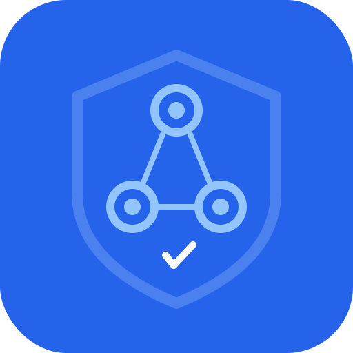

<p align="center">
  
</p>

<h1 align="center">AI-Trace</h1>

<p align="center">
  <strong>Enterprise AI Decision Audit & Tamper-Proof Evidence System</strong>
</p>

<p align="center">
  <a href="#features">Features</a> •
  <a href="#quick-start">Quick Start</a> •
  <a href="#documentation">Docs</a> •
  <a href="#sdk">SDK</a> •
  <a href="./README_CN.md">中文</a>
</p>

<p align="center">
  <a href="https://github.com/jnMetaCode/ai-trace/actions/workflows/ci.yml"></a>
  
  
  
  
</p>

---

## Why AI-Trace?

As AI becomes critical in enterprise decisions, organizations face growing challenges:

| Challenge | AI-Trace Solution |
|-----------|-------------------|
| **Regulatory Compliance** | Tamper-proof audit trails for AI decisions |
| **Black Box Problem** | Full transparency of AI reasoning chain |
| **Data Tampering Risk** | Merkle tree + blockchain anchoring |
| **Privacy Concerns** | Minimal disclosure proofs (Zero-knowledge) |

## Features

```
┌─────────────────────────────────────────────────────────────┐
│                      AI-Trace Architecture                   │
├─────────────────────────────────────────────────────────────┤
│                                                             │
│   Your App ──→ AI-Trace Gateway ──→ LLM (OpenAI/Claude/Gemini) │
│                      │                                      │
│                      ▼                                      │
│              ┌──────────────┐                               │
│              │ Event Store  │                               │
│              │ INPUT→MODEL  │                               │
│              │ →OUTPUT      │                               │
│              └──────┬───────┘                               │
│                     │                                       │
│                     ▼                                       │
│              ┌──────────────┐                               │
│              │ Merkle Tree  │                               │
│              │ Certificate  │                               │
│              └──────┬───────┘                               │
│                     │                                       │
│          ┌─────────┼─────────┐                              │
│          ▼         ▼         ▼                              │
│      internal  compliance   legal                           │
│                                                             │
└─────────────────────────────────────────────────────────────┘
```

### Core Capabilities

- **Full-Chain Event Capture** - INPUT / MODEL / RETRIEVAL / TOOL_CALL / OUTPUT / POST_EDIT
- **Tamper-Proof Certificates** - Merkle tree binding with cryptographic hashes
- **Three Evidence Levels** - internal / compliance (TSA+WORM) / legal (Blockchain)
- **Minimal Disclosure Proofs** - Reveal only what's needed, protect the rest
- **Multi-Provider Proxy** - Works with OpenAI, Claude, Gemini, and any OpenAI-compatible API
- **Open Source Verifier** - Independent offline verification

## Quick Start

### Option 1: Docker (Recommended)

```bash
# Clone the repository
git clone https://github.com/jnMetaCode/ai-trace.git
cd ai-trace

# Start all services
docker-compose up -d

# Check status
docker-compose ps
```

Access:
- Console: http://localhost:3006
- API: http://localhost:8006
- API Docs: http://localhost:8006/swagger

### Option 2: Local Development

```bash
# Prerequisites
# - Go 1.24+
# - Node.js 20+
# - PostgreSQL 15+
# - Redis 7+

# 1. Start dependencies
docker-compose up -d postgres redis minio

# 2. Run backend
cd server
go run ./cmd/ai-trace-server

# 3. Run frontend (new terminal)
cd console
npm install && npm run dev
```

## Usage

### 1. Proxy AI Requests (Auto-Trace)

```bash
# Simply change your OpenAI base URL
curl -X POST http://localhost:8006/api/v1/chat/completions \
  -H "Content-Type: application/json" \
  -H "X-API-Key: your-api-key" \
  -d '{
    "model": "gpt-4",
    "messages": [{"role": "user", "content": "Hello!"}]
  }'
```

### 2. Generate Certificate

```bash
curl -X POST http://localhost:8006/api/v1/certs/commit \
  -H "Content-Type: application/json" \
  -H "X-API-Key: your-api-key" \
  -d '{"trace_id": "trc_xxx", "evidence_level": "internal"}'
```

### 3. Verify Certificate

```bash
# Via API
curl -X POST http://localhost:8006/api/v1/certs/verify \
  -H "Content-Type: application/json" \
  -d '{"cert_id": "cert_xxx"}'

# Via CLI (offline)
ai-trace-verify --cert certificate.json
```

## SDK

### Python

```bash
pip install ai-trace-sdk
```

```python
from ai_trace import AITraceClient

client = AITraceClient(
    base_url="http://localhost:8006",
    api_key="your-api-key"
)

# Search events
events = client.events.search(trace_id="trc_xxx")

# Create certificate
cert = client.certs.commit(trace_id="trc_xxx", evidence_level="internal")

# Verify
result = client.certs.verify(cert_id=cert.cert_id)
print(f"Valid: {result.valid}")
```

### OpenAI Drop-in Replacement

```python
from openai import OpenAI
client = OpenAI(
    api_key="sk-...",
    base_url="http://localhost:8006/api/v1"  # Just add this line
)
# Your code stays exactly the same
```

### Anthropic Claude

```python
import anthropic
client = anthropic.Anthropic(
    api_key="sk-ant-...",
    base_url="http://localhost:8006/api/v1"  # Just add this line
)
message = client.messages.create(
    model="claude-sonnet-4-20250514",
    max_tokens=1024,
    messages=[{"role": "user", "content": "Hello!"}]
)
# Every request is traced & certified
response = client.chat.completions.create(
    model="gpt-4",
    messages=[{"role": "user", "content": "Hello!"}]
)
# Now every request is automatically traced!
```

## Evidence Levels

| Level | Time Proof | Anchoring | Use Case | Cost |
|-------|------------|-----------|----------|------|
| **internal** | Local signature | Local DB | Internal audit | Free |
| **compliance** | TSA timestamp | WORM storage | SOC2/GDPR/HIPAA | $ |
| **legal** | TSA timestamp | Blockchain | Legal disputes | $$ |

## Project Structure

```
ai-trace/
├── server/          # Go backend (Gin + pgx)
├── console/         # React frontend (Vite + Ant Design)
├── sdk/python/      # Python SDK
├── verifier/        # Open source CLI verifier
├── docs/            # Documentation
└── deploy/          # Deployment configs
```

## Documentation

- [Quick Start Guide](./docs/quick-start.md)
- [API Reference](./docs/api-reference.md)
- [SDK Guide](./docs/sdk-guide.md)
- [Deployment Guide](./docs/deployment.md)
- [Architecture](./docs/architecture.md)

## Roadmap

- [x] Core event capture & Merkle tree
- [x] internal/compliance evidence levels
- [x] Python SDK
- [x] CLI Verifier
- [ ] legal (Blockchain) evidence level
- [ ] Java/Go SDK
- [ ] Audit report generation
- [ ] Multi-model support (Claude, Gemini)

## Contributing

We welcome contributions! Please see [CONTRIBUTING.md](./CONTRIBUTING.md) for guidelines.

```bash
# Run tests
make test

# Run linter
make lint

# Format code
make fmt
```

## How is AI-Trace Different?

| | AI-Trace | LangSmith | Arize AI | W&B |
|---|:---:|:---:|:---:|:---:|
| **Tamper-proof evidence** | Merkle + Blockchain | - | - | - |
| **Privacy-preserving proofs** | ZKP minimal disclosure | - | - | - |
| **Blockchain anchoring** | Ethereum/Polygon | - | - | - |
| **OpenAI compatible API** | Drop-in replacement | - | - | - |
| **Self-hosted option** | Full control | - | - | - |
| **Open source** | Core + SDK + Verifier | Partial | - | - |
| **EU AI Act ready** | Designed for compliance | - | - | - |

## License

- **Server & Console**: [AGPL-3.0](./LICENSE) — free to use, modifications must be open-sourced
- **SDK, Verifier, Schema**: [Apache-2.0](./sdk/LICENSE) — use freely in any project
- **Smart Contracts**: [MIT](./contracts/LICENSE) — maximum flexibility
- **Enterprise License**: Available for organizations that need non-AGPL terms — [contact us](mailto:hello@aitrace.cc)

## Community

- [GitHub Issues](https://github.com/jnMetaCode/ai-trace/issues) - Bug reports & feature requests
- [Discussions](https://github.com/jnMetaCode/ai-trace/discussions) - Q&A and ideas
- [Twitter](https://twitter.com/ai_trace) - Updates and news

---

<p align="center">
  <strong>Making AI Decisions Trustworthy & Verifiable</strong>
</p>
